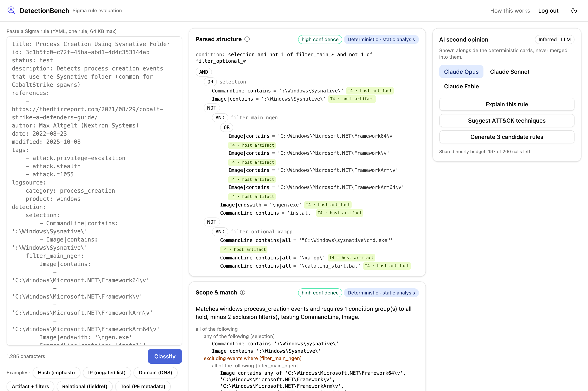

<p align="center">
  
</p>

# DetectionBench

**DetectionBench** is a workbench for understanding cybersecurity detection
rules. Paste a [Sigma](https://sigmahq.io) rule and it tells you what the rule
actually matches, how much effort an attacker needs to slip past it (its tier
on David Bianco's Pyramid of Pain), whether it carries the metadata a
responder needs at three in the morning, and whether the ATT&CK techniques it
claims to cover exist. Every one of those answers is computed deterministically
by parsing and walking the rule's structure, with the resolution steps shown so
you can audit the result. An AI second opinion sits alongside, labelled as
such, and never replaces the deterministic score.

<p align="center">
  
</p>


Live: **[detectionbench.ai](https://detectionbench.ai)** (access-token gated).

v1 reads Sigma rules only. Suricata and YARA are on the roadmap.

## What it does

Five deterministic cards, same answer every time for the same input:

1. **Parsed structure** — the rule's condition resolved into a tree of AND, OR
   and NOT nodes whose leaves are individual field tests, with every selection
   expanded (a value list is an OR, a multi-key selection is an AND,
   `1 of filter_*` is expanded to the blocks it names).
2. **Scope & match** — the same structure rendered as prose: "fires when the
   command line or the program path contains `:\Windows\Sysnative\`, excluding
   events where the program is ngen.exe installing". Symbolic only; nothing is
   executed against telemetry.
3. **Pyramid of Pain** — the rule's durability tier (Hash, IP, Domain,
   Host/network artifact, Tool, TTP), resolved from the parsed structure with
   the rules described below, plus the step-by-step trace that produced it and
   advisories where the method is deliberately conservative.
4. **Lint** — metadata and structural checks: valid UUID, recognised status and
   level, a description that says more than the title, references, a
   false-positives note that says more than "Unknown", populated log source,
   every selection used by the condition, at least one ATT&CK technique tag,
   and ATT&CK tags that resolve.
5. **ATT&CK mapping** — declared `attack.*` tags checked against a bundled,
   offline copy of MITRE ATT&CK Enterprise; unknown techniques are errors,
   retired ones are flagged with their replacement, renamed tactics are noted.

Plus an **AI second-opinion panel** (Claude, called server-side only; the
browser never sees a model ID or API key) with three actions:

- **Explain this rule** in plain language (streamed).
- **Suggest ATT&CK techniques** the author may have missed.
- **Generate 3 candidate rewrites** that aim to reduce false-positive surface
  while keeping or raising the tier. Every candidate is fed back through the
  deterministic pipeline before you see it and labelled *raised*, *preserved*,
  *regressed* or *parse failed*. The model proposes; the verifiable logic
  checks.

## How it works

Everything is built on one intermediate representation (IR).

```
YAML text ──► pySigma ──► normalized IR ──► Parsed structure card
  (64 KB cap,  (resolved      (built once,   ├─► Scope & match
   safe_load)   condition      walked by     ├─► Pyramid of Pain
                tree)          every stage)  ├─► Lint
                                             └─► ATT&CK mapping
```

The YAML is handed to [pySigma](https://github.com/SigmaHQ/pySigma), which
resolves the `condition` into a boolean tree. DetectionBench converts that
tree, not the raw `detection` dict, into its own IR: `Boolean {and|or|not,
children}` nodes over `Criterion {selection, field, modifiers, values,
tier, category}` leaves. Each leaf is placed on the pyramid at build time by a
field taxonomy that also uses `logsource` as a signal (a DNS rule's `query`
field is a domain; `SubjectDomainName` is an AD domain, not an indicator; a
known offensive tool named in `Image` stays a host artifact because renaming
defeats it, while the same name in `OriginalFileName` or `Description` reaches
the Tool tier because defeating it costs a binary patch). This is **static
analysis** of the rule text and structure; the rule is never run.

The Pyramid of Pain tier is then resolved over the IR in a fixed order:

| Step | Rule |
|---|---|
| Filters | A NOT branch AND-ed beside a non-negated branch (`selection and not filter_x`) is an exclusion filter. It is excluded from the tier and reported as an evasion surface, with the cheapest filter named. |
| AND | Minimum tier of the required branches. The attacker only has to break the cheapest required condition. |
| OR | Maximum tier of the alternatives. The attacker has to defeat every branch; the hardest is the bottleneck. |
| TTP escalation | Applied last, only to AND nodes: promote to TTP only when every required branch is already tier 4 or above **and** the branches span at least two evidence categories. Medium confidence. It can never override the minimum. |
| Bare NOT | `not selection` over an indicator list behaves as an allowlist: scored at that indicator's tier, medium confidence, with a note that durability is likely understated. The same applies when an AND's only positive branches are context (`EventID: 4688 and not filter_x`). |
| Context fields | Routing fields (`Channel`, `Provider_Name`, `EventID`, ...) and outcome/status fields (`errorCode`, `result`, ...) still floor the tier but are not evidence for TTP escalation, and an advisory says the floor is conservative. |

Every result carries **confidence** (`high`, `medium`, `low`: how the answer
was reached, not how good the rule is) and **provenance**:

- `deterministic:static` — computed by walking the parsed structure
- `deterministic:metadata` — read from a field the author declared, then checked
- `inferred:llm` — a model said it; shown separately, never merged

## Static analysis today, dynamic analysis next

v1 is static: it reasons about what the rule *would* match from its text and
structure alone. **Dynamic analysis is not built.** The roadmap version
generates and labels test telemetry, executes the rule against it, and reports
TP / FP / TN / FN, and from those precision, recall and the F1 score. The same IR drives both: static
analysis walks it, dynamic analysis will execute it. Until then the Scope &
match card is deliberately symbolic, because a made-up match rate is worse
than none.

## Roadmap

- **Dynamic analysis** — labelled test data, rule execution, confusion matrix
  and precision/recall/F1 (above).
- **Suricata and YARA** — parallel parsers into the same IR and pipeline.
  Suricata's rule grammar maps naturally onto Python's own parsing and syntax
  tree tooling as the front-end; YARA has a mature parser ecosystem.
- **MCP server** exposing the workbench, so an AI agent can develop, test,
  refine and deploy rules against a deterministic static (and later dynamic)
  test bench. The point is that whatever can be checked deterministically is
  checked deterministically rather than left to human or model inference;
  that is what separates a vibe-coded rule from a verified one.
- **Evaluation history** — v1 is stateless by design; a persisted record of
  past classifications is the first stateful feature.
- **Per-reviewer access tokens** instead of one shared secret.
- **Filter cost scoring** — exclusion filters are listed today, not scored.

## Related work: Summiting the Pyramid

MITRE's Center for Threat-Informed Defense published
[Summiting the Pyramid](https://ctid.mitre.org/projects/summiting-the-pyramid/),
a methodology for scoring how robust an analytic is to adversary evasion. It
places observables on five levels (1 ephemeral values, 2 adversary-brought
tools, 3 pre-existing tools / inside the boundary, 4 core to some
implementations of a technique, 5 core to the technique) alongside a
sensor-placement column, and it works through a Detection Decomposition
Diagram by hand. Its central rule, that analytic components ANDed together
fall to the score of the lowest observable, is the same AND-minimum rule
DetectionBench applies, and it reaches the same conclusions we do: behaviour-
level detections are more robust than indicator matches, and filters trade
robustness for fewer false positives. It is a manual, analyst-driven
procedure, and its authors note that not every analytic can be scored.

DetectionBench's contribution is to compute the score automatically and
deterministically from the rule's parsed structure, using Bianco's six tiers
as the scale, so it applies to rulesets of thousands of rules (the full
public Sigma corpus, for example) with the resolution steps shown per rule so
a human can audit each result, and so that candidate rewrites, whether written
by a person or a model, are re-scored by the same engine.

## Local development

Backend (Python 3.14, [uv](https://docs.astral.sh/uv/)):

```sh
cd backend
uv sync
DETECTIONBENCH_ACCESS_TOKEN=dev-token \
DETECTIONBENCH_SESSION_SECRET=dev-secret \
DETECTIONBENCH_INSECURE_COOKIES=1 \
uv run uvicorn app.main:app --port 8000
```

Set `DETECTIONBENCH_ANTHROPIC_API_KEY` as well to enable the AI panel; without
it the panel reports itself as not configured and everything else works.

Frontend (Node, Vite + React + TypeScript, Tailwind + shadcn/ui):

```sh
cd frontend
npm install
npm run dev     # proxies /api to http://127.0.0.1:8000
```

Open the dev URL, enter the access token, and classify one of the bundled
example rules.

## Testing

```sh
cd backend && uv run pytest -q --cov=app --cov-report=xml:coverage.xml
cd frontend && npm run typecheck && npx vitest run && npx oxlint src
```

The backend suite covers table-driven boolean resolution (AND-min, OR-max,
filter exclusion, bare NOT, TTP escalation allowed and blocked, `fieldref`),
seven golden fixtures (one real public rule per tier and edge case, with
expected output checked end to end), the lint table, ATT&CK resolution, the
auth gate, and candidate re-scoring against canned model output with no live
API. CI runs the same commands on every push and pull request and reports
coverage to SonarCloud.

## Deployment

Single host: FastAPI under systemd, Caddy in front with automatic TLS, the
backend bound to loopback only. Caddy serves the static frontend build and
proxies `/api/*` to the backend, so everything is same-origin and there is no
CORS. No database, no Docker.

```sh
ssh root@host 'bash /opt/detectionbench/deploy.sh'          # deploy main
ssh root@host 'bash -s -- my-branch' < deploy.sh            # deploy a branch
```

`deploy.sh` fetches the ref, builds the frontend, syncs backend dependencies,
runs the backend tests (and aborts on red), restarts the service, then polls
`/api/health` locally and through Caddy so a broken deploy or proxy config is
caught before the script exits green.

## Security notes

- Access is gated by a single shared token, compared in constant time, with a
  per-IP rate limit on the verify endpoint. A valid token sets a signed,
  stateless session cookie (HMAC, ~24 h expiry); logout clears it, and a
  stolen cookie cannot be revoked before expiry. That trade-off is deliberate
  for v1.
- Every `/api/*` route except health and the auth routes requires the cookie.
  The backend listens on `127.0.0.1` only; secrets arrive via systemd
  credentials, never the environment or the repo.
- Request bodies are capped at 64 KB before the YAML parser runs, which is the
  defence against YAML expansion attacks.
- AI endpoints have a per-IP rate limit plus a global hourly call budget, a
  60 s timeout, and the browser never sees the API key or model ID. Model
  output is rendered as plain text only, never as HTML or markdown, because
  rule titles and descriptions flow into the prompt and are attacker-
  influenceable.

## Attribution

- Example rules are unmodified rules from the
  [SigmaHQ repository](https://github.com/SigmaHQ/sigma), licensed under the
  [Detection Rule License 1.1](https://github.com/SigmaHQ/Detection-Rule-License);
  see [`backend/app/resources/examples/ATTRIBUTION.md`](backend/app/resources/examples/ATTRIBUTION.md).
- The bundled ATT&CK dataset is derived from MITRE ATT&CK® Enterprise and used
  under its terms of use; see
  [`backend/app/resources/attack/ATTRIBUTION.md`](backend/app/resources/attack/ATTRIBUTION.md).
  This project is not affiliated with or endorsed by MITRE.
- The Pyramid of Pain is
  [David Bianco's](https://detect-respond.blogspot.com/2013/03/the-pyramid-of-pain.html).
- Sigma parsing is by [pySigma](https://github.com/SigmaHQ/pySigma).

## License

Apache 2.0 — see [LICENSE](LICENSE).
